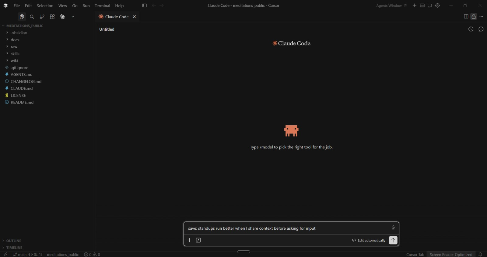

# Cursor setup

This file covers the recommended way to run Marcus if you work primarily in Cursor or VS Code and do not have a 24/7 machine. Fewer moving parts than the phone path, visible feedback while you work, and no always-on machine in the loop.

## How to use this doc

The easiest way to follow this is to open a fresh Claude Code session in the Meditations folder, type `Follow @docs/SETUP.md`, and say you want to set up the Cursor or VS Code extension. The setup guide agent will walk you through the install and the fresh-window discipline one step at a time. The README has a ready-to-paste prompt.

## Primary sources

- [Claude Code landing page](https://claude.com/claude-code) — canonical install flow for the CLI and the IDE extensions.

Marketplace listing URLs drift between IDE versions. Search for "Claude Code" in your IDE's extensions marketplace and trust what comes back over any link a stale doc hands you.

## What it does

Open the Meditations folder in Cursor or VS Code. Install the Claude Code extension. The extension gives you a chat panel inside the IDE that is just a Claude Code session rooted at that folder. All eight Marcus operations work over this path because it is a real Claude Code session against the real local repo: `save:`, `brief:`, `ingest:`, `compile`, `wiki:`, `lint`, `teach-back`, `weekly-reflection`.

The difference versus running `claude` in a terminal is cosmetic but load-bearing in practice. You see the file tree, the diff on each write, the Obsidian graph updating if you have the vault open in a second window, and the entity pages being rewritten as observations land. That visible feedback is what builds trust in the wiki over time. You watch Marcus do the work and you notice faster when something is off.

## Why this is the recommended default for people without a 24/7 machine

Claude Channels from a phone require the laptop to stay on: if the session is not running when a message arrives, the message is not delivered. Claude routines require github sync discipline on both sides. Both are legitimate paths and both are covered in [phone-setup.md](phone-setup.md). Both also have costs.

Cursor or VS Code with the extension has almost none of them. No bot, no tokens, no cloud clone, no always-on laptop, no pull-before-work ritual. You capture when you are at the machine; when you are not, scheduled routines fill the gap — a daily push of an old observation, a Sunday reflection prompt, scheduled lint runs. Channels can also reach a session from a phone, but only if you have an always-on machine (Mac Mini, home server, VPS, or a laptop that literally never closes — a restart for a system update breaks the pairing). For most users, Cursor plus scheduled routines is the right default.

## Install the extension

1. Open Cursor (or VS Code).
2. Install the Claude Code extension from your IDE's extensions marketplace. Search for "Claude Code."
3. Sign in with your claude.ai account when the extension prompts.
4. Open the Meditations folder (`File → Open Folder`).
5. Open the extension's chat panel. The extension adds a sidebar icon and a keybind; the exact shape differs between Cursor and VS Code. Check the extension's own readme in the marketplace listing for the current detail.

Anything beyond that is the extension's job, not this doc's. The canonical install flow at [claude.com/claude-code](https://claude.com/claude-code) stays current when this file would not.

## Fresh window per capture — the discipline

This is the load-bearing section. Read it carefully.

Every `save:`, every `brief:`, every `wiki:` should happen in a **new chat window**. Not a continuation of the previous turn, not appended to the last thing you were doing. Fresh window per capture.

The reason is context accumulation. The main session is a single conversation; every new capture adds to its context; after a handful of captures the new skill invocations are dragging the prior wiki traffic through every call. That slows things down, burns tokens, and degrades skill behavior in ways that are hard to notice from inside the session.

The coordinator-subagent pattern in [phone-setup.md](phone-setup.md) solves the same problem automatically. Each inbound Telegram message spawns a fresh subagent that reads `CLAUDE.md` and `AGENTS.md` cold, handles the one message, returns text, and dies. Each capture gets clean scope; the main session stays small.

The Cursor version is the same discipline, done by hand. Fresh subagent per phone message and fresh chat per Cursor capture are the same idea: clean scope per unit of work. The only difference is who opens the new window.

Exceptions where staying in the same window is correct:

- A long planning conversation with Coach in `docs/COACH.md`. One long session is the point.
- A `teach-back` or `weekly-reflection`, where the back-and-forth is the skill.
- A multi-turn clarification on an `ingest:`, where Marcus is asking which atoms to file.

The rule is "fresh window per capture," not "fresh window per sentence."

## How one author actually uses this

One working setup, for reference. This is not a prescription; other shapes work equally well.

The author of the repo started on the terminal path: `claude` in a shell inside the Meditations folder. It worked well for focused sessions, but without a dedicated always-on machine like a Mac Mini, keeping the session alive across days was fragile. Channels from the phone need the laptop awake; a closed lid or a restart for a system update breaks the pairing.

The switch was to Cursor as the daily driver for everything substantive: `brief:`, `save:`, `ingest:`, `compile`, `teach-back`, `lint`. Visible feedback — file tree, diff, graph — is why this path wins on the laptop. New chat per capture; the occasional longer planning session with Coach.

One bespoke addition the same author runs separately: a custom API-triggered routine wired to an iOS Shortcut for one-shot `save:` captures from a phone. Routines expose an HTTP endpoint per routine, so a Shortcut can POST a line of dictated text and the routine writes the observation file in the cloud clone and pushes to github. The wiring (auth tokens, payload plumbing, Shortcut round-trip) is finicky enough that the repo does not ship a worked example — this is one author's customization, not a turnkey option a new reader should try to replicate. The one-paragraph pointer in [phone-setup.md](phone-setup.md) is all the repo says about it. The tradeoff on the no-always-on-laptop setup is that `brief:` and `compile` stay on the laptop, which is fine: brief deserves attention and compile should be deliberate.

Other setups are equally valid. Channels-always-on works great for anyone with a Mac Mini or a spare machine. Routines-only works for users who rarely sit at a laptop. Pick the shape that fits the way you already work.

## What this doc is not

Not a tutorial that clicks through the extension install. The marketplace listing stays current when this file would not. It names the path and the discipline; the rest is between you, your IDE, and your claude.ai tier.
