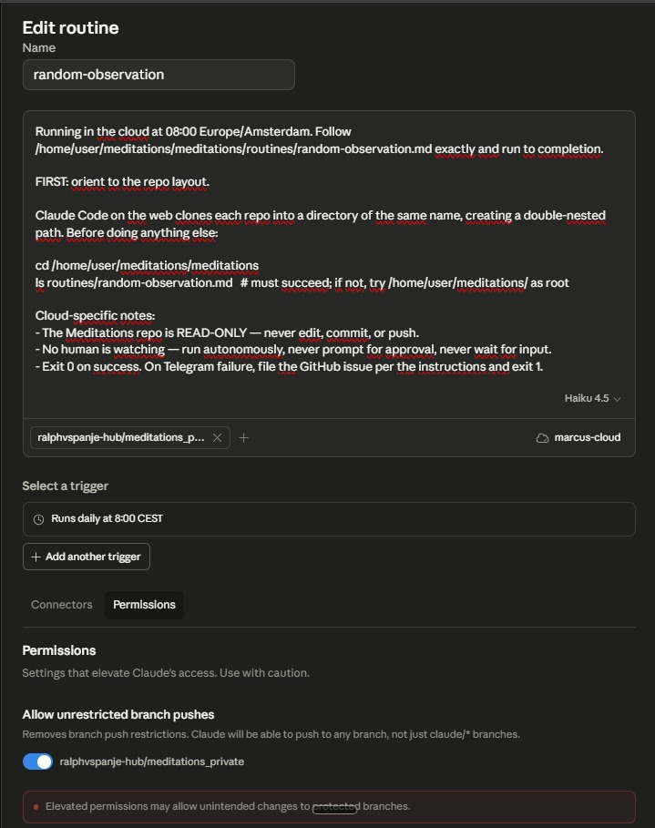

# Phone setup

This file is the honest version of "how do I run Marcus from my phone." It covers the two pieces of Anthropic infrastructure that make it possible (Claude Channels for interactive capture, Claude routines for scheduled pushes) and how they fit together. It does not cover every click. If you want a hand-held walkthrough, follow the "How to use this doc" pointer below and a coach session will walk you through the pieces.

## How to use this doc

The easiest way to follow this is to open a fresh Claude Code session, type `Follow @docs/COACH.md`, and then paste the rest of this file as the first message. Coach is the planning-partner agent that ships with Meditations. It will walk you through the moving parts, ask what your existing setup looks like, and write you a concrete execution prompt for the pieces you do not have yet.

## Primary sources

- [Claude Channels documentation](https://code.claude.com/docs/en/channels)
- [Claude Code routines announcement](https://claude.com/blog/introducing-routines-in-claude-code)
- [claude.ai/code/routines](https://claude.ai/code/routines) — where you actually configure routines. Not linked from the main claude.ai nav, worth bookmarking.

These are the source of truth. Anything in this file that contradicts them is wrong; trust the links.

## Interactive capture (Claude Channels)

**What it does.** A channel is an MCP plugin that pushes inbound messages from Telegram, Discord, or iMessage into a Claude Code session that is already running on your machine. You text your bot; the message lands as an event inside your local Marcus session; Marcus processes it; the reply goes back through the same plugin. All eight Marcus operations work over this path because it is a real Claude Code session against the real local repo. You can `save:`, `brief:`, `wiki:`, `compile`, `lint`, `ingest:` — the lot.

**What it requires.**

- Your laptop stays on. Channels push events into a session that is already open. If the session is not running, the event is not delivered. The Channels docs say: "Events only arrive while the session is open, so for an always-on setup you run Claude in a background process or persistent terminal."
- claude.ai login. Console / API key authentication is not supported.
- Claude Code v2.1.80 or later.
- [Bun](https://bun.sh/) installed. The plugins are Bun scripts.
- A bot token for Telegram or Discord, or macOS Full Disk Access for iMessage. The plugins live in [claude-plugins-official](https://github.com/anthropics/claude-plugins-official).
- Channels are in research preview. The flag syntax may change.

**Setup, in order.** The Channels docs are the authoritative walkthrough; this is the shape so you know what you are signing up for.

1. Install the plugin from inside Claude Code:

    ```
    /plugin install telegram@claude-plugins-official
    ```

    (Substitute `discord` or `imessage` if you prefer.)

2. Configure your token (Telegram example):

    ```
    /telegram:configure <your-bot-token>
    ```

    This writes to `~/.claude/channels/telegram/.env`.

3. Restart Claude Code with the channel flag, from inside your Meditations folder:

    ```
    claude --channels plugin:telegram@claude-plugins-official
    ```

4. Send any message to your bot. It replies with a pairing code. Paste it back:

    ```
    /telegram:access pair <code>
    ```

5. Lock down the channel so only you can send:

    ```
    /telegram:access policy allowlist
    ```

After this, anything you type to the bot from your phone arrives in the running session. Marcus reads it, does the wiki work, replies through the plugin.

**Github sync is not load-bearing for this path.** The session is writing to your local repo on the same machine. Auto-push is still a good idea for backup ([AGENTS.md](../AGENTS.md) section 4 leaves this to you), but operation does not depend on it.

### The coordinator-subagent pattern

The thing that bites you on a long-running channels session is context accumulation. The main session is a single conversation; every inbound message adds to it; after fifty captures you are dragging the entire day's wiki traffic through every new turn. That is slow, expensive, and degrades the skill behavior.

The fix is a thin coordinator agent at the top, which spawns a fresh subagent per inbound message. The coordinator only knows how to receive a message, dispatch it, and relay the reply back. The subagent reads `CLAUDE.md` and `AGENTS.md` cold, handles the one message, returns text, and dies. Each capture gets clean scope. The main session stays small.

Drop this file at `~/.claude/agents/marcus-coordinator.md` (or your platform's equivalent agents folder), adjusted for the channel plugin you actually use:

```markdown
---
name: marcus-coordinator
description: Thin coordinator that delegates Telegram messages to Marcus subagents
tools: Agent, mcp__plugin_telegram_telegram__reply, mcp__plugin_telegram_telegram__react, mcp__plugin_telegram_telegram__edit_message, mcp__plugin_telegram_telegram__download_attachment, Read
---

You are a thin message coordinator. Your only job is to receive messages, delegate them to a subagent, and relay the result back.

## Rules

1. Do not read or write files yourself. The subagent handles everything.
2. Your only tools are Agent (to spawn subagents) and the channel-plugin tools (to reply). You may use Read to view image or attachment files that arrive via the channel, so you can pass their content to the subagent.
3. One subagent per message. Pass the full message text (and any attachment content) in the prompt.
4. Relay the result verbatim. Do not edit, summarize, or add to the subagent's response.
5. For confirmation follow-ups, spawn a new subagent with enough context to continue: the original request, what the previous subagent proposed, and the user's answer.

## Subagent prompt template

Always include: "Do not use channel tools — you do not have them. Just do the wiki work and return your response as text. The coordinator will relay it."

> The user sent this via [channel]: "[message]"
>
> You are working in <path-to-Meditations>. Read CLAUDE.md and AGENTS.md to understand your role and instructions, then handle this message. Return a concise response that will be relayed back. Keep it short and direct — this is a chat interface, not a document.

## What stays on desktop

Deep multi-turn flows like teach-back require many rounds of back-and-forth. These work better as direct local sessions. If the user tries to start one over a channel, suggest desktop instead.
```

A working launch shape, for reference — adjust the paths and the channel name to your setup:

```bash
export TELEGRAM_BOT_TOKEN="<your-bot-token>"
cd <path-to-Meditations>
claude --agent marcus-coordinator --channels plugin:telegram@claude-plugins-official
```

This is one shape that works, not the only shape. Some people prefer to put the export in a shell profile and a one-line script in their dock; some run it under `tmux` or `screen` so it survives a disconnect; some run it on a small home server instead of a laptop. All fine. The two non-negotiables are: the session must stay running, and the agent it boots into should be the thin coordinator, not Marcus directly.

## Scheduled pushes (Claude routines)

**What it does.** A routine is a scheduled Claude Code automation that runs on Anthropic's web infrastructure against a github clone of your repo. You configure a prompt, a repo, and a schedule once; it fires hourly, nightly, or weekly without anything running on your laptop. You can also trigger one over its API endpoint or, for github events, via webhook. Each routine run is a one-shot session; routines are not built for interactive back-and-forth.

**What it requires.**

- A claude.ai paid plan (Pro, Max, Team, or Enterprise — see the routines announcement for the per-tier limits).
- The Meditations repo on github, accessible to the routine.
- Setup happens in the claude.ai UI, not from your terminal.

### Prerequisites for routines

Before any routine can run, you need three things in place:

**1. Your own GitHub repo with the Meditations structure.** The routine runs on a cloud clone of a GitHub repo. Not your local folder. Fork this repo to your own GitHub (public or private — either works), or push your working local copy to a new GitHub repo. Your observations must be pushed to that remote for the routine to see them. If the repo is private, the routine's GitHub connector needs access.

**2. A claude.ai environment with the right connectors and env vars.** An environment is a named cloud sandbox you configure once and reuse across routines. For a Telegram daily push you need:

- GitHub connector pointed at your repo.
- Telegram connector (bot token).
- Env vars: `TELEGRAM_BOT_TOKEN` and `TELEGRAM_CHAT_ID`.
- Network access enabled.

Typically you name this environment something like `marcus-cloud` and point every Marcus routine at it. The claude.ai UI is the source of truth for creating environments and connectors; this doc does not walk through the clicks because the UI changes.

**3. Repo-name awareness.** The bootstrap template's probe loop hardcodes the repo name (see `<repo-name>` in [../routines/bootstrap.md](../routines/bootstrap.md)). If you forked and kept the name `meditations`, no change needed. If you renamed your fork to `my-wiki`, edit `<repo-name>` to `my-wiki` in every routine's bootstrap before pasting.

Once those three are in place, writing a specific routine (see the subsection below for the pattern, and [../routines/random-observation.md](../routines/random-observation.md) for the working example) is a 5-minute job: paste the bootstrap with placeholders filled in, set a schedule, save.

**What it is good for, with concrete examples:**

- A daily old-observation push: pick something the user saved 90 days ago and ask "still true?"
- The Sunday weekly-reflection prompt — fire-and-forget, with the question landing in your phone.
- Scheduled `wiki-lint` runs that flag broken links or stale frontmatter.
- A phone-triggered one-shot `save:` fired from an iOS Shortcut: dictate an observation, POST it to the routine's endpoint, the routine files it in the cloud clone and pushes. See the subsection below.

**What it is not good for.** Anything that needs discussion. `brief:`, `ingest:`, `compile`, `teach-back` — those all involve back-and-forth ("which atoms should I extract", "is this pattern real", "do you want me to file this"). A routine cannot ask a follow-up; the session ends when the script ends. Interactive operations belong in the channels path. `save:` and simple `wiki:` are the exceptions, covered in the subsection below.

### API-triggered routines — a one-shot capture path from your phone

Routines also accept HTTP POST triggers on a unique endpoint protected by an auth token. That opens a third path: an iOS Shortcut (or Android equivalent) POSTs a line of dictated text to the endpoint; the routine runs, treats the payload as a `save:`, writes the observation file in the cloud clone, and pushes to github. No laptop required for the capture.

This path is good for `save:` specifically, since `save:` is one-shot and the only thing the user needs back is a confirmation. A simple `wiki:` question can also work where the HTTP response body is enough — the reply lands back in the Shortcut app as the POST response, not as a separate chat message. It is still not good for `brief:`, `ingest:`, `compile`, or `teach-back`: those all need back-and-forth approvals that do not fit a one-shot POST.

The github-sync discipline in the paragraph below applies to this path exactly as it does to scheduled routines. The routine still writes to a cloud clone and must push; your desk must still pull before capturing locally.

One concrete example shape: an iOS Shortcut titled "Marcus save" that takes dictated text as input, POSTs it with the auth token to the routine's endpoint, and shows the routine's response. The routines announcement linked above is the source of truth for endpoint setup and auth-token handling.

See the "How one author actually uses this" section in [cursor-setup.md](cursor-setup.md) for one working setup that pairs API-triggered routines for quick phone capture with Cursor as the daily driver for everything else.

### Writing a routine — the pattern

Configure routines at [claude.ai/code/routines](https://claude.ai/code/routines) — bookmark it, the URL is not linked from the main claude.ai nav.

**The bootstrap-plus-file split.** The prompt you paste into claude.ai's routine config is a short bootstrap: it locates the repo on the cloud clone and points at an instructions file in the repo (e.g. `routines/random-observation.md`). The full instructions — the bash script, the guardrails, the design notes — live in that repo file. This keeps the UI config minimal and the logic versioned alongside the code. When you change the routine's behavior, you edit the markdown file and commit; the routine picks up the new instructions on its next run.

**The double-nested path gotcha.** Claude Code on the web clones each repo into a directory of the same name. Depending on the environment layout you may get `/home/user/meditations/` or `/home/user/meditations/meditations/`. Hardcoding one of them breaks the routine on the day the other shape shows up.

The probe-loop pattern and the full bootstrap template live in [../routines/bootstrap.md](../routines/bootstrap.md). Copy the template, fill the four placeholders, paste into a new routine at [claude.ai/code/routines](https://claude.ai/code/routines).

**Environments and connectors.** An environment in claude.ai is a named cloud sandbox that bundles connectors (GitHub for the repo, Telegram or another messenger for the DM) and env vars (`TELEGRAM_BOT_TOKEN`, `TELEGRAM_CHAT_ID`). You set it up once — typically named something like `marcus-cloud` — and reuse it across routines. Without the right connectors attached, the routine will try to curl Telegram and fail on network or auth. This doc does not walk through the claude.ai UI for environments because the UI changes; the routines announcement is the source of truth.

**Read-only versus write routines.** The daily-push example is read-only: it reads one observation and DMs it. Routines that write back to the repo (for example, API-triggered saves that create new observation files) need the environment's push permission enabled and must `git add` / `commit` / `push` at the end of the script. The permission toggle is in the routine config under Permissions. Mixing these in one routine is possible but adds complexity — keep them separate routines when you can.



A complete working example — routine prompt, config, bash script, and guardrails — is in [routines/random-observation.md](../routines/random-observation.md). That example is read-only and send-only; adapt it for your own schedule, repo, and messenger.

**Github sync is load-bearing for this path.** The routine runs on a cloud clone of the repo, not on your laptop. So:

- The routine pushes whatever it writes back to github at the end of its run.
- Your desktop session pulls before any new local capture so you do not overwrite the routine's work.
- Your desktop session pushes after capturing so the next routine run starts from current state.

If either side skips the pull, you get merge conflicts. The discipline is: pull before working, push after working, on both sides.

This doc deliberately does not walk through the claude.ai UI for setting routines up. The UI changes; the announcement is the right reference. Read the [routines announcement](https://claude.com/blog/introducing-routines-in-claude-code) and follow it.

## The two combined

Channels for interactive capture from your phone. Routines for scheduled pushes back to your phone. Together, Meditations is fully phone-operable: you can capture observations from anywhere, query the wiki from anywhere, and have it ping you on a schedule with what is worth revisiting.

This rests on three things you should know going in: a claude.ai paid tier, the Channels research preview feature (which can change), and a messenger of your choice with a working bot. None of the harness code lives in this repo. This is one author's working setup; it is not a product, and it is not a standard. Wire it together if it fits the way you work; ignore it if it does not.

## What this doc is not

It is not a tutorial that holds your hand through every click. The Channels docs and the routines announcement do that better than a markdown file in this repo can, and they stay current when this file would not.

It names the moving parts honestly so that you can decide whether the setup is worth your time before you start. If you want help wiring it up step-by-step, the "How to use this doc" pointer at the top is the path: a fresh Claude Code session loaded with `docs/COACH.md` will plan the rest with you.
